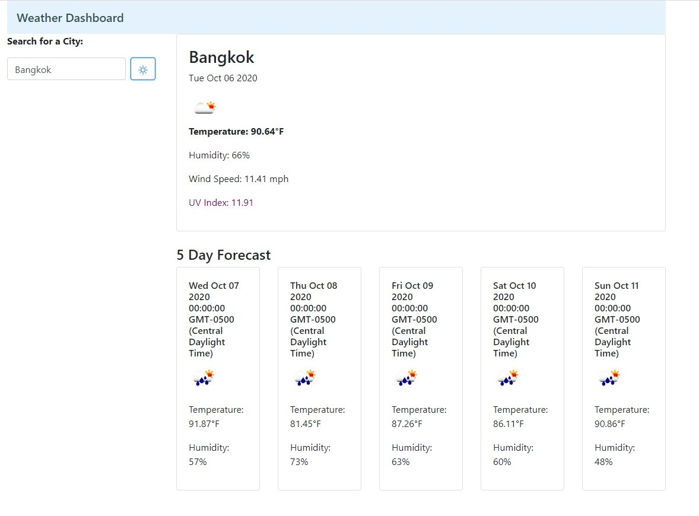

# Weather Dashboard
This application allows users to view current weather and forecasted weather for any legitimate city around the world.

**Created**: `2020 October 6`
 
Deployed at: https://charlinelach.github.io/weather/
 
Repository: https://github.com/charlinelach/weather

## Technologies
HTML, CSS, JavaScript

# Development

## Usage Instructions
To utilize this website/application, end users may access it via [deploy link](https://charlinelach.github.io/weather/). From this website, the user can look at the weather for a city and easily navigate to past weather searches.
 
This application will display the city's name, dates (for each weather day), weather icon, temperature, humidity, wind speed, and UV index.

 
To view weather, the user can enter a city name in the Search field on the left and hit the sun/search button. Upon doing so, the screen displays the city's weather for the current day and a 5-day forecast.

## Installation Instructions
N/A

## Credits & Thank Yous
**Per usual**
 
Shout out to the wonderful instructor and TAs!
 
And a big thank you to fellow students, asking and answering questions before and after I consider them.

# License Information
The weather information is gathered from ©[OpenWeather](https://openweathermap.org/) and its API provision.
 
MIT License Copyright © 2020
